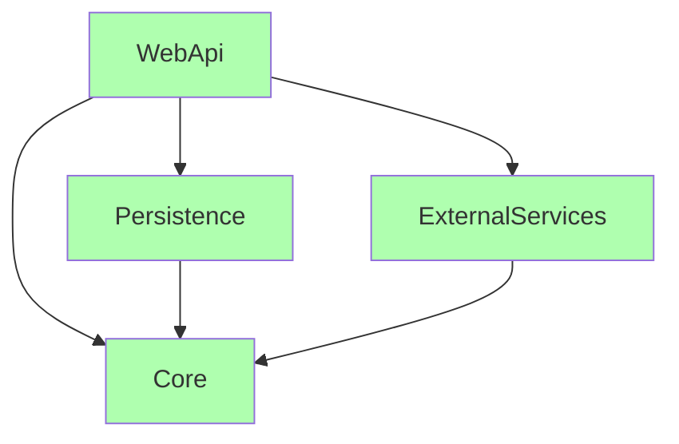

# Hexagonal architecture (Ports and Adapters)

<br />

A small example of an application which allows to create and reschedule an appointment.

<br/>

The idea is to concentrate business logic in a **Core** project alongside with defined interfaces (ports). All communication goes through interfaces, **Core** is completely decoupled from any external systems. Interfaces define **what** to do and concrete implementations (**how** to do) provided through adapters.

<br/>

Adapters are essentially other projects referencing Core and implementing interfaces defined there.

<br/>

Adapters don't reference each other and don't know about each other. However, we need a **Composition root** where dependency injection happens and that root will reference all adapters.

<br/>

In real life scenario UI project could act as composition root. However UI itself is also an adapter which sounds like a contradiction to the general idea of Hexagonal architecture which to some extend true. However even though UI reference adapters it doesn't call them directly and only inject dependencies.

<br />

## Solution structure:

<br />

```
📁 Hexagonal/
│
├───📁 Adapters
│   │
│   ├───📁 ExternalServices
│   │       📄 CalendarAdapter.cs
│   │       🛠️ ExtermalServices.csproj
│   │
│   ├───📁 Persistence
│   │       📄 AppointmentRepositoryAdapter.cs
│   │       🛠️ Persistence.csproj
│   │
│   └───📁 WebApi
│           📄 Program.cs
│           🛠️ WebApi.csproj
│           │
│           └───📁 Configuration
│                   📄 CompositionRoot.cs
│
├───📁 Core
│   │   🛠️ Core.csproj
│   │
│   ├───📁 Domain
│   │       📄 Appointment.cs
│   │
│   ├───📁 Exceptions
│   │       📄 InvalidAppointmentException.cs
│   │
│   ├───📁 Ports
│   │       📄 IAppointmentRepository.cs
│   │       📄 ICalendarService.cs
│   │
│   └───📁 UseCases
│           📄 CreateAppointmentCommand.cs
│           📄 CreateAppointmentCommandHandler.cs
│           📄 RescheduleAppointmentCommand.cs
│           📄 RescheduleAppointmentCommandHandler.cs
│
└───📄 Hexagonal.sln
```
<br />

## Project structure

- **Core** - Contains domain entities, use cases, business logic and ports (interfaces).
- **ExternalServices** - external adapters like calendar service in this case.
- **Persistence** - Persistence storage adapter implementation.
- **WebApi** - HTTP Adapter, also contains composition root.

<br />

## Dependency graph



<br />

In this example composition root lives in WebApi adapter since it's also the entry point for application:

```csharp
    public static class CompositionRoot
    {
        public static IServiceCollection InjectAdapters(this IServiceCollection services)
        {
            services.AddScoped<ICalendarService, CalendarAdapter>();
            services.AddScoped<IAppointmentRepository, AppointmentRepositoryAdapter>();
            services.AddScoped<CreateAppointmentCommandHandler>();
            services.AddScoped<RescheduleAppointmentCommandHandler>();

            return services;
        }
    }
```

<br />

Notice how all interfaces (ports) defined in **Core**: for instance ```ICalendarService``` and ```IAppointmentRepository```.
However implementation for ```ICalendarService``` comes from ```ExernalServices``` project and implementation for ```IAppointmentRepository``` is in ```Persistence``` project.
This is the essence of Hexagonal architecture - **Core** doesn't know about any external systems and all communication goes through interfaces (ports).
