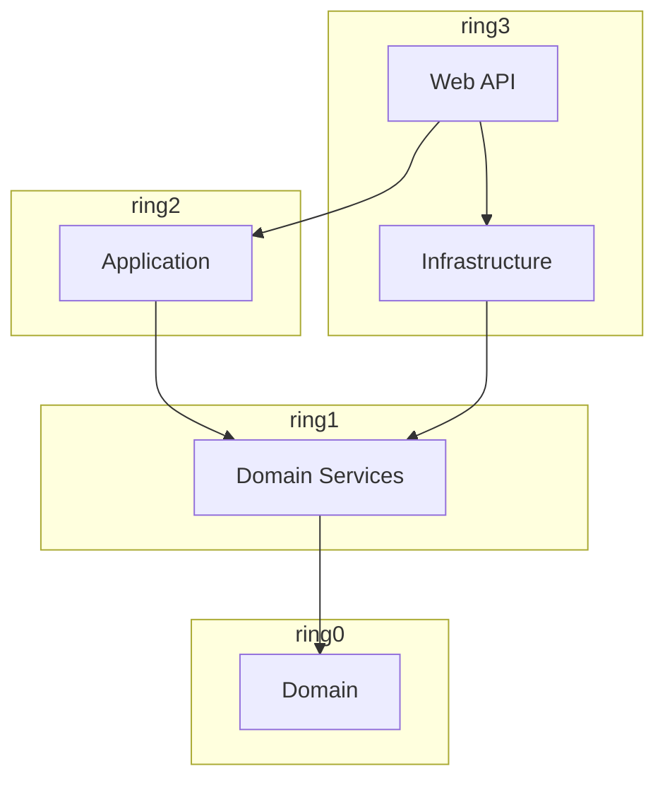

# Onion architecture

<br />

A small example of an application which allows to create and reschedule an appointment.

<br />

**Domain** is decoupled from the rest of the application and that's the inner ring. Next ring (**DomainServices**) references Domain and contains domain business logic.
Similar to Hexagonal architecture it can define only the interfaces (what can domain do) which will be implemented in a different ring as well as concrete implementation of domain business logic.
The application ring above it is **Application** ring containing use-cases, DTOs, mappers etc. The very outer ring contains Infrastructure and UI.

## Solution structure:

<br />

```
📁 Ring_0
    └── 📁 Domain
        ├── 📄 Appointment.cs
        ├── 📄 Domain.csproj
        └── 📁 Exceptions
            └── 📄 InvalidAppointmentException.cs

📁 Ring_1
    └── 📁 DomainServices
        ├── 📄 AppointmentService.cs
        ├── 📄 DomainServices.csproj
        ├── 📄 IAppointmentRepository.cs
        ├── 📄 IAppointmentService.cs
        └── 📄 ICalendarService.cs

📁 Ring_2
    └── 📁 Application
        ├── 📄 Application.csproj
        ├── 📄 AppointmentAppService.cs
        ├── 📄 IAppointmentAppService.cs
        └── 📁 DTOs
            └── 📄 AppointmentDto.cs

📁 Ring_3
    ├── 📁 Infrastructure
    │   ├── 📄 Infrastructure.csproj
    │   ├── 📁 ExternalServices
    │   │   └── 📄 CalendarService.cs
    │   └── 📁 Persistence
    │       └── 📄 AppointmentRepository.cs
    │
    └── 📁 WebApi
        ├── 📄 Program.cs
        └── 📄 WebApi.csproj
```
<br />

## Project structure

- **Domain**          -   ring 0. Domain model.
- **DomainServices**  -   ring 1.Domain services - domain business logic coordinating domain entities.
- **Application**     -   ring 2. Use cases, DTOs.
- **Infrastructure**  -   ring 3. External services, repositories, etc.
- **WebApi**          -   ring 3. HTTP API.

<br />

## Dependency graph



<br />
